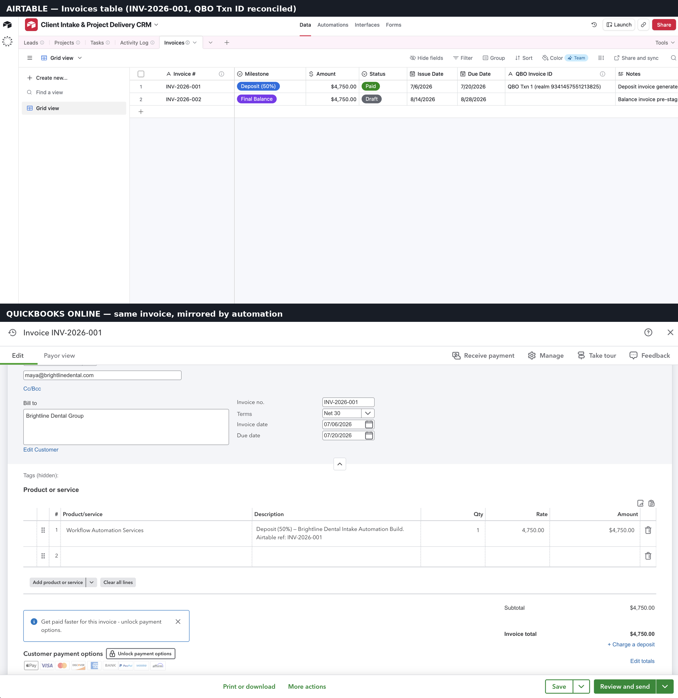
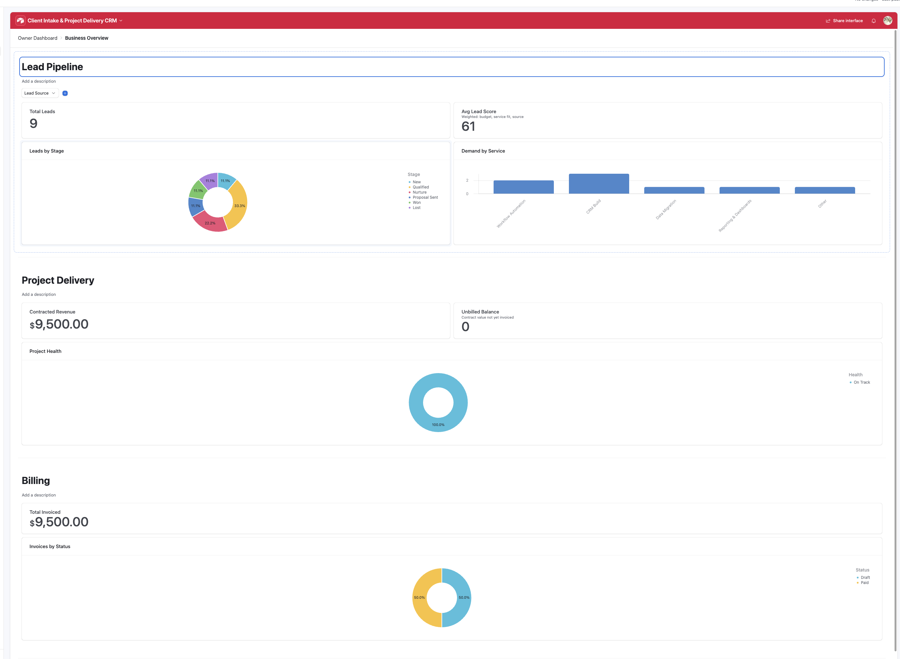

# Airtable Automation Portfolio

Three working business systems built on Airtable, JavaScript, and API integrations — each one live, tested, and documented as a case study. Not mockups: the CRM routes real records, the invoice below exists in both Airtable and QuickBooks Online, and the migration pipeline's output is verifiable row by row.



*One invoice, two systems: generated in Airtable by the milestone-billing automation, mirrored to QuickBooks Online, reconciled by transaction ID.*

---

## Projects

### 1. Client Intake & Project Delivery CRM
*[Case study](case-studies/01-client-intake-crm.md) · [`lead-router.js`](scripts/lead-router.js) · [`project-health-check.js`](scripts/project-health-check.js)*


*Live: a lead is entered by hand, then the routing automation scores it and advances the Stage with no one touching it.*



*The published Interface dashboard for non-technical owners — pipeline metrics with an end-user filter dropdown, project health, and billing, live against the same tables.*


*Cross-platform: the same project's client-facing portal in Notion — status, billing, and a live task database mirroring the Airtable system of record via middleware.*

Four-table CRM where inbound leads are scored 0–100 on weighted factors, auto-routed (Qualified / Nurture / manual review), and answered within minutes; won deals scaffold projects with templated tasks, and a nightly script compares task completion against timeline elapsed to set project health — alerting only on downgrades. Implemented twice: as automation scripts (Team plan) and as a formula + no-code fallback (free tier), with the tradeoff documented. Includes a production gotcha found and fixed during deployment: Airtable's condition triggers ignore records that already match at enablement.

### 2. Milestone Invoicing with QuickBooks Sync
*[Case study](case-studies/02-invoicing-quickbooks-sync.md) · [`invoice-generator.js`](scripts/invoice-generator.js)*

Billing layer that invoices on project milestones automatically: 50% deposit at kickoff, remaining balance at delivery — computed against the invoiced-to-date rollup so change orders bill correctly. Sequential invoice numbering that survives deleted drafts, an Unbilled Balance field that catches revenue leakage, and a QuickBooks mirror via webhook middleware so OAuth tokens never live inside the base. The screenshot above is the reconciliation proof.

### 4. AI Video Persona — Generative Production Pipeline
*[Case study](case-studies/04-ai-video-persona-pipeline.md) · [showcase repo](https://github.com/wolfvswhale/ai-persona-video-pipeline)*

A running short-form video series fronted by a synthetic host, produced end-to-end by one operator: ElevenLabs voice, word-timestamp-aligned subtitles (the delivered script verbatim, never the transcription), archival + generated period imagery, a two-stage avatar build that keeps the character consistent across episodes, and programmatic rendering in Remotion (React) — all tracked in an Airtable production base. One human gate per episode; everything else runs straight through.

### 3. Legacy Data Migration Pipeline
*[Case study](case-studies/03-data-migration-pipeline.md) · [`migration/`](migration/)*

Zero-dependency Node.js pipeline that took a 113-row legacy export — five phone formats, four date formats, "Last, First" names, duplicate clients, junk rows — and produced 89 clean, typed records imported to Airtable in API-limit batches. Duplicates merge field-by-field instead of dropping (21 records kept data naive dedupe would lose), every rejected row carries its reason, and every fix is counted in [`report.json`](migration/report.json): 74 phones re-formatted, 84 dates normalized, 63 emails cleaned.

---

## Also: Writing & Editorial

Four books adapted from raw translation into readable prose, published under the Parapet Press imprint (as J. Alderman Lyell; credited as editor — Amazon has no "adapted by" role). Two are first-ever English editions: Kuroiwa Ruikō's *The Ghost Tower* (Yūreitō) and Carolina Invernizio's *The Attic Mysteries*; plus Turgenev's *Tales of the Uncanny* and the twelve-tale anthology *Russian Ghost Stories*.

## Repository layout

```
case-studies/   Written case studies, one per project
scripts/        Airtable automation scripts (paste into Automations → Run a script)
migration/      Migration pipeline: source data, migrate.js, quality report
docs/           Setup guide for wiring the automation scripts
assets/         Screenshots and proof artifacts
```

## Running the migration pipeline

```bash
cd migration
node migrate.js legacy_export.csv
# → clean.json, rejects.json, report.json
```

No dependencies. Node 18+.

## What these projects demonstrate

Relational schema design with computed fields doing the bookkeeping (formulas, rollups, counts); JavaScript automation beyond no-code limits; integration architecture with a defensible security boundary; data cleaning and deduplication with auditable output; cross-platform delivery (Airtable as system of record, Notion as the client-facing layer); and the judgment calls documented in each case study — when a formula beats a script, why middleware holds the OAuth tokens, why dedupe should merge instead of drop.
